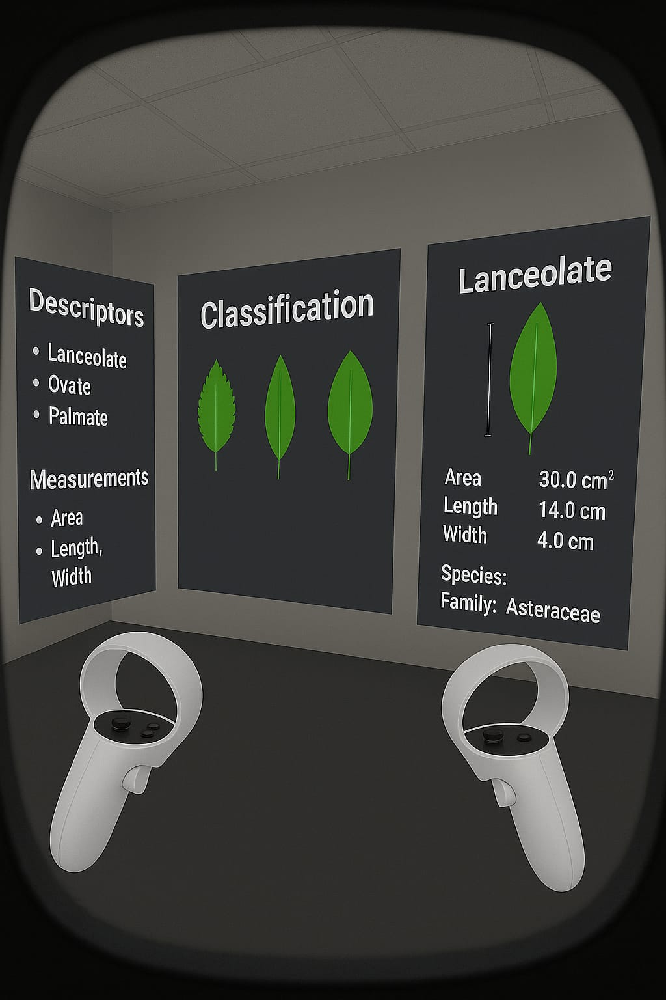

  

<h2 align="center">Hi, I'm Jéssica! 👋</h2>

  Undergraduate student in <strong>Biological Sciences</strong> at <em>UEMASUL</em> 🌱 
  Passionate about technology, data, and science working together to solve real-world problems.

  

---

### 🔬 What I'm Working On

- 🌿 Taxonomic identification of angiosperms using **machine learning**
- 🔢 Creating a **leaf morphometric database** for supervised models
- 🤖 Combining **ImageJ2 + Orange + R + Python** for data analysis in biology

---

### 🧠 Interests

- Machine Learning in Biological Data 🧠🌿  
- Scientific Visualization 📊  
- Data Analysis with R & Python 🐍  
- AI in Biosciences 🤖  
- Biological Image Processing 🔬  

---

### 🛠️ Tools & Technologies

  
  
  
  
  

---

### 📁 Featured Projects

🔹 [**Leaf Morphometric Database for ML-based Taxonomy**](https://github.com/ajessica6/banco-dados-folhas-ml)  
🔹 [**R Scripts for Species Classification**](https://github.com/ajessica6/analises-taxonomicas-r)

---

### 🌿 VR 

  
   
  

---

### 📫 Let's Connect

- 📧 jesnascimento2016@hotmail.com  
- 🌱 Feel free to reach out if you're into **AI for Science**, **plant data**, or **open research collaboration**!

---

  

  <strong>🌿 “Let the data bloom.”</strong>

